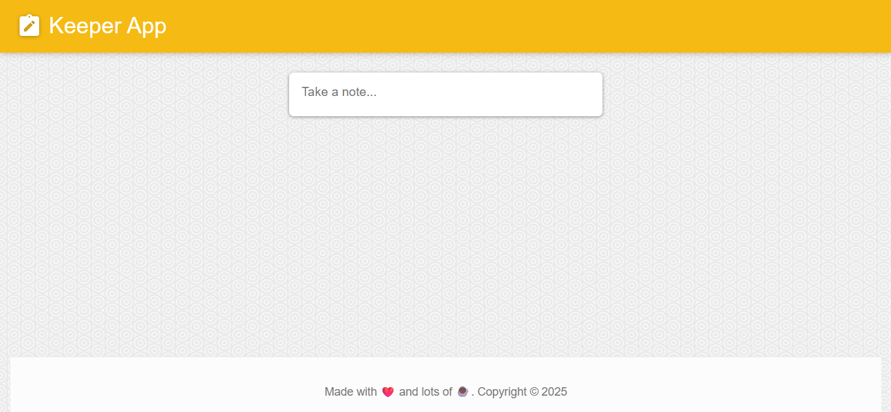
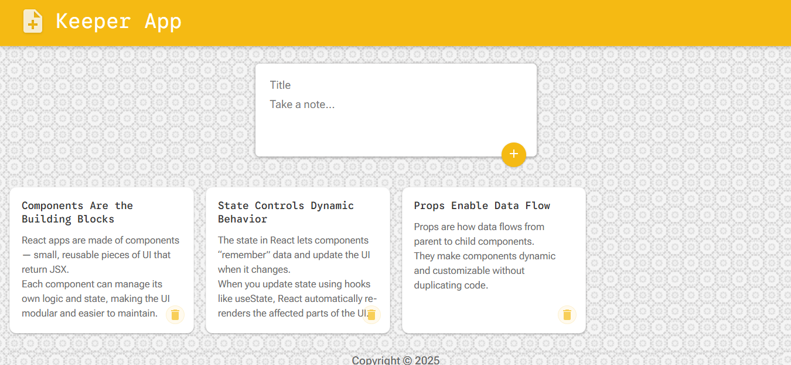

# 📝 Keeper App

A modern, elegant note-taking application built with React and Material-UI. Inspired by Google Keep, this app allows users to create, manage, and organize their notes with a clean and intuitive interface.

## 📸 Screenshots

| Empty State | With Notes |
|-------------|------------|
|  |  |
| Clean interface ready for your first note | Organized notes in a responsive grid layout |

## ✨ Features

### 📋 Core Functionality
- **Create Notes**: Add notes with title and content
- **Delete Notes**: Remove unwanted notes with a single click
- **Expandable Form**: Click to expand the note creation form
- **Auto-collapse**: Form automatically collapses after 2 minutes of inactivity
- **Real-time Updates**: Instant note creation and deletion

### 🎨 User Interface
- **Modern Design**: Clean, Material Design-inspired interface
- **Responsive Layout**: Works seamlessly on desktop and mobile devices
- **Smooth Animations**: Polished transitions and hover effects
- **Textured Background**: Elegant arabesque pattern background
- **Professional Styling**: Consistent color scheme and typography

### 🔧 Technical Features
- **React Hooks**: Built with modern React functional components
- **State Management**: Efficient state handling with useState and useEffect
- **Material-UI Icons**: Beautiful, consistent iconography
- **UUID Generation**: Unique identifiers for each note
- **Auto-focus**: Title input automatically focuses when form expands
- **Timer Management**: Smart auto-collapse functionality

## 🚀 Getting Started

### Prerequisites
- Node.js (version 16 or higher)
- npm or yarn package manager

### Installation

1. **Clone the repository**
   ```bash
   git clone https://github.com/SankerProtus/Web-Projects.git
   cd keeper-app
   ```

2. **Install dependencies**
   ```bash
   npm install
   ```

3. **Start the development server**
   ```bash
   npm run dev
   ```

4. **Open your browser**
   Navigate to `http://localhost:3000` to see the app in action.

## 🛠️ Available Scripts

- `npm run dev` - Start the development server
- `npm run build` - Build the app for production
- `npm run preview` - Preview the production build
- `npm run lint` - Run ESLint to check code quality

## 📁 Project Structure

```
keeper-app/
├── public/                 # Static assets
├── src/
│   ├── assets/
│   │   └── images/        # Application images
│   ├── components/        # React components
│   │   ├── CreateNote.jsx # Note creation form
│   │   ├── Footer.jsx     # Application footer
│   │   ├── Header.jsx     # Application header
│   │   └── Note.jsx       # Individual note component
│   ├── App.jsx           # Main application component
│   ├── App.css           # Global styles
│   └── main.jsx          # Application entry point
├── package.json          # Project dependencies
└── vite.config.js        # Vite configuration
```

## 🎯 How to Use

### Creating a Note
1. Click on the "Take a note..." text area
2. The form will expand, and the title field will automatically focus
3. Enter your note title and content
4. Click the "+" button or press Enter to save

### Managing Notes
- **View Notes**: All your notes are displayed in a responsive grid layout
- **Delete Notes**: Click the delete icon in the top-right corner of any note
- **Auto-collapse**: The form will automatically collapse after 3 minutes of inactivity

## 🌟 Key Features Explained

### Auto-collapse Timer
The app includes an intelligent auto-collapse feature:
- Timer starts when the form expands (2 minutes)
- Timer resets on any user interaction (typing, submitting)
- Timer continues after adding notes for continued use
- Automatic cleanup prevents memory leaks

## 🤝 Contributing

1. Fork the project
2. Create your feature branch (`git checkout -b feature/AmazingFeature`)
3. Commit your changes (`git commit -m 'Add some AmazingFeature'`)
4. Push to the branch (`git push origin feature/AmazingFeature`)
5. Open a Pull Request

## 📄 License

This project is open source and available under the [MIT License](LICENSE).

## 👨‍💻 Author

Built with ❤️ using React and Material-UI.

---

**Enjoy taking notes with Keeper App! 📝✨**